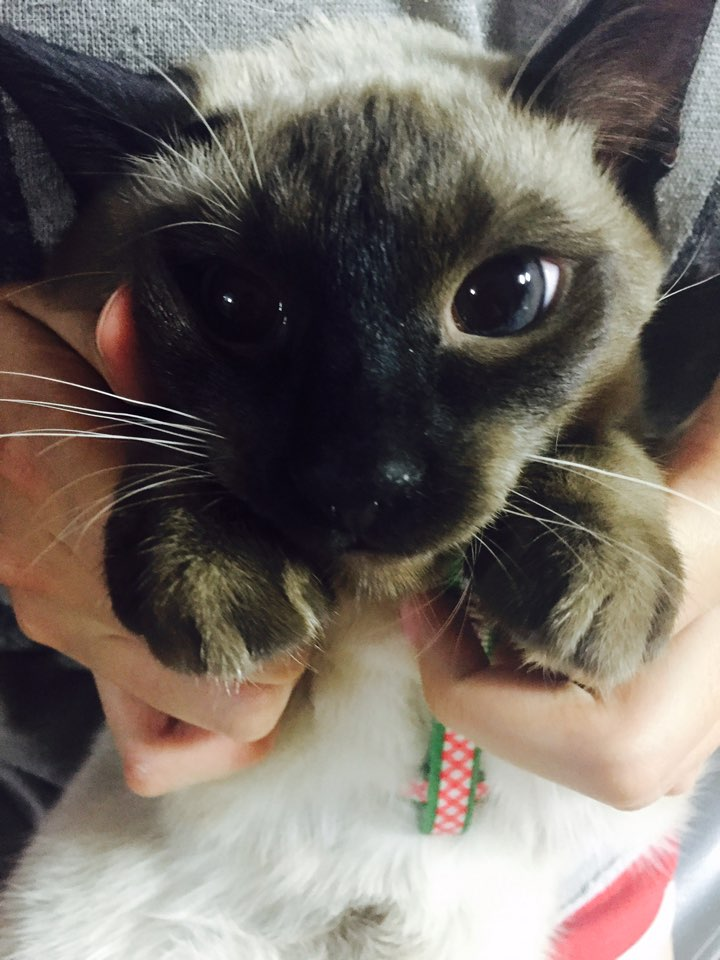
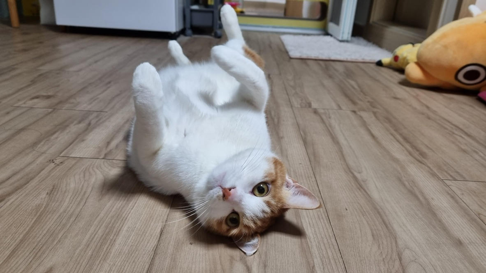
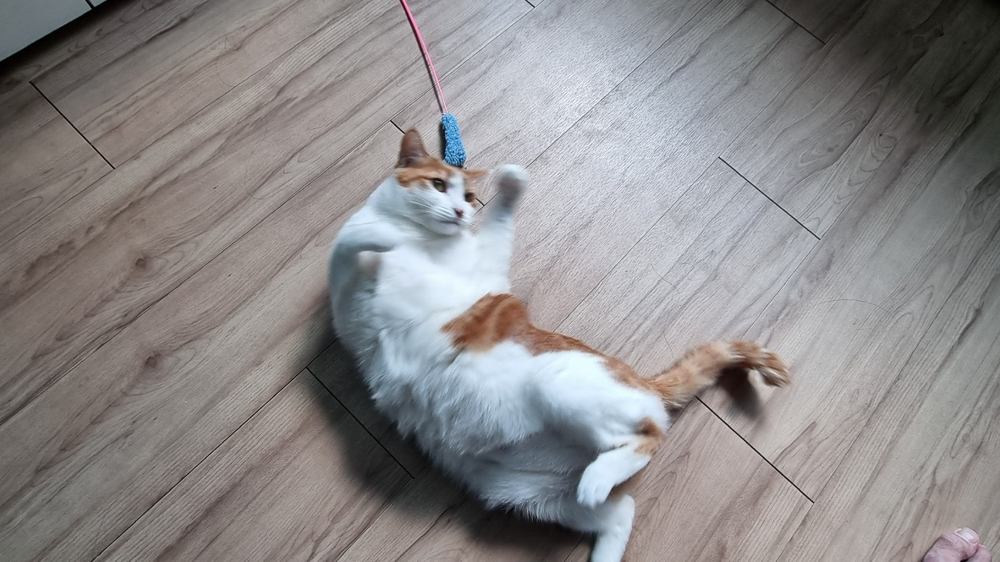
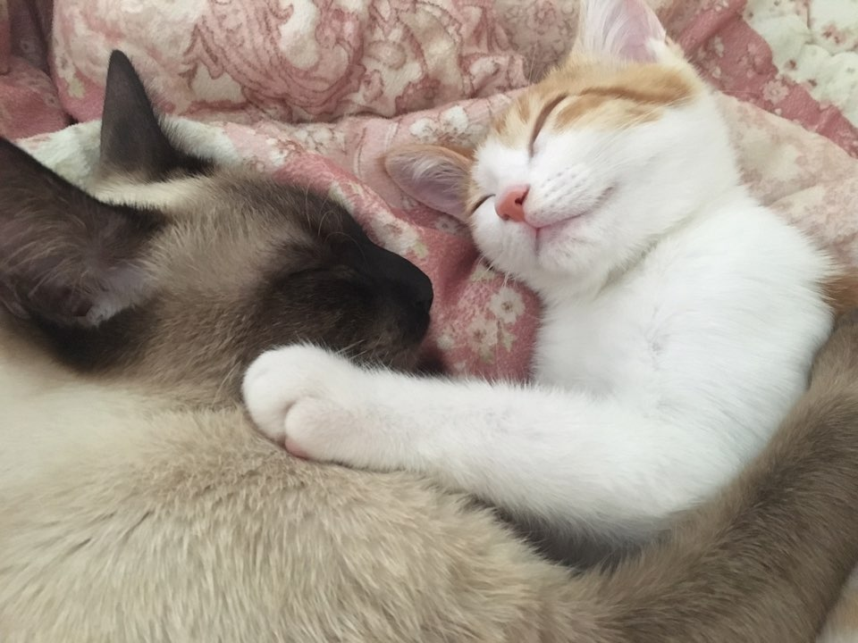

&nbsp;
&nbsp;

  <h1>Chang Won's Blog</h1>

  
   

  - [Homepage](https://penil93.github.io/blog/)
  - [GitHub](https://github.com/Penil93/blog)
  

This is noobie's README page who want to make own homepage or blog. 
I am planning to review AI (ML) papers, engage in Computer Science studies (or coding), and gain some kind of experience to implement ML on this site.

  <a href="https://penil93.github.io/blog/">Live Blog</a>

## Blog Base Theme
- **Chripy** [Source Code](https://github.com/cotes2020/jekyll-theme-chirpy)
  > Apply hold cuase of GitHub Actions failed

## 👍 Reference URLs
- [Blog posting & customizing](https://github.com/ansohxxn/ansohxxn.github.io)
- [Paper review(KR, wookee3)](https://github.com/wookee3/paper-review)
- [Paper review(KR, hyunsooworld)](https://hyunsooworld.tistory.com/)

---

And enjoy our **CUTE** cats pictures!

## Wandu

## Hodu

## Wandu and Hodu

---

<h4>Contacts</h4>

&nbsp;
&nbsp;
&nbsp;