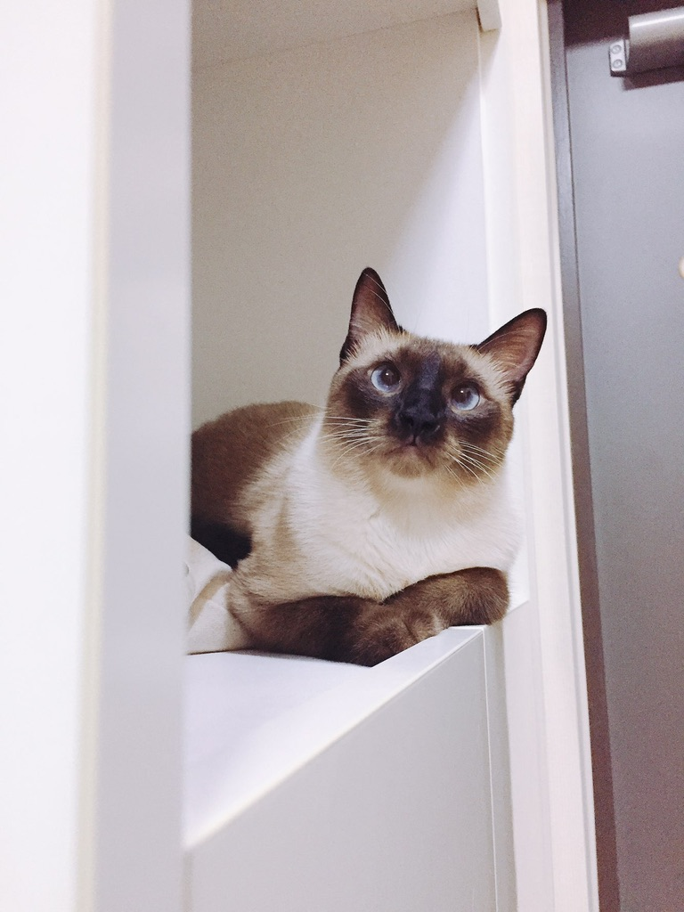
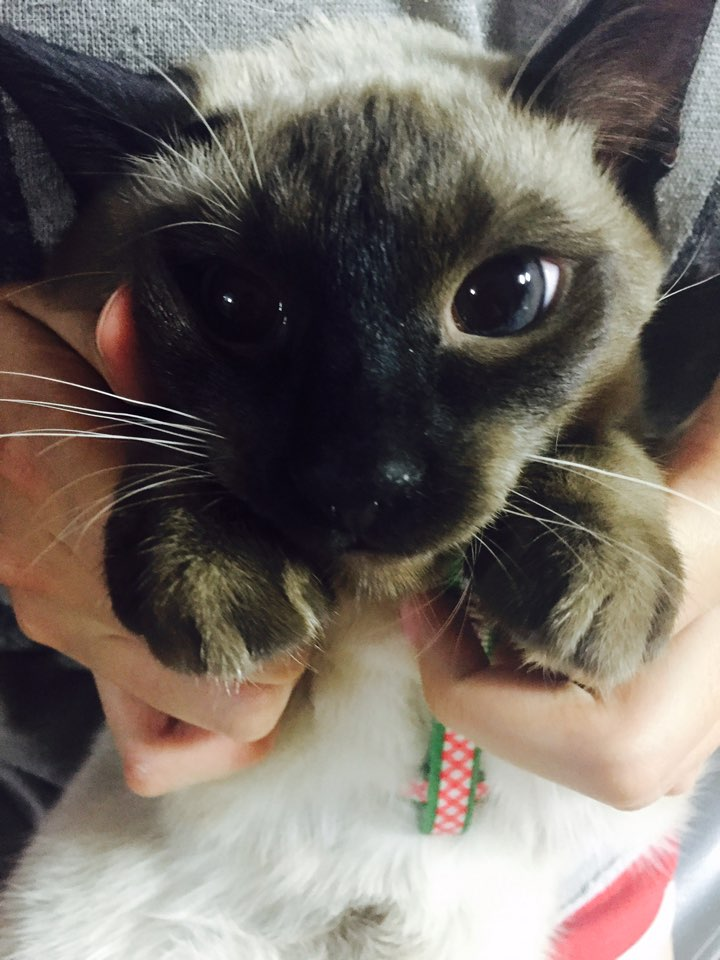
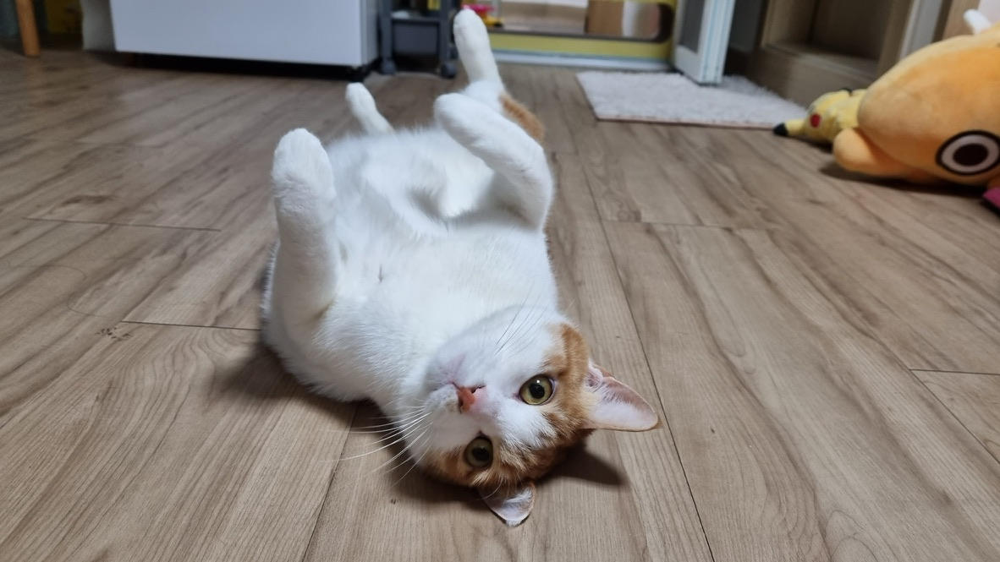
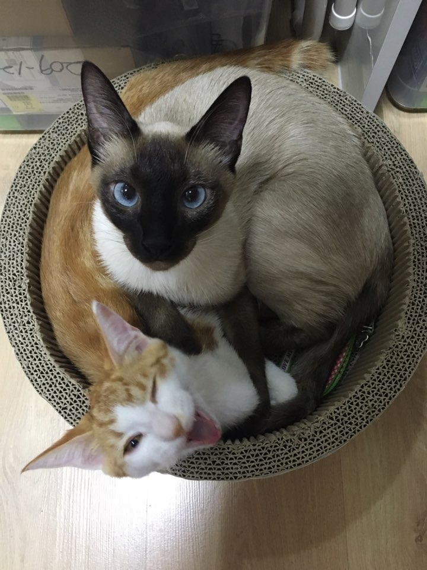

---
---

&nbsp;
&nbsp;

  <h1>창완's Blog</h1>

  
   

  

  홈페이지를 만들고 싶은 뉴비의 리드미 페이지입니다!
  

  <a href="https://penil93.github.io/blog/">Live Blog</a>

---

그리고 우리집 고양이 사진을 즐기세요!

## 완두

## 호두

## 완두랑 호두랑

---

<h4>Contacts</h4>

&nbsp;
&nbsp;
&nbsp;